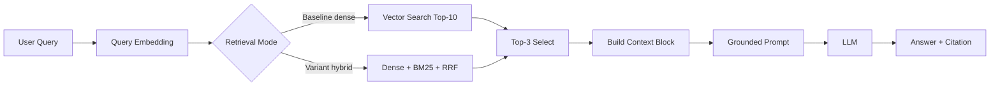

# Architecture - RAG Pipeline (Day 08 Lab)

> Completed from Sprint 1-4 implementation and scorecard output.

## 1. Tổng quan kiến trúc

```
[Raw Docs]
    ↓
[index.py: Preprocess → Chunk → Embed → Store]
    ↓
[ChromaDB Vector Store]
    ↓
[rag_answer.py: Query → Retrieve/Hybrid → Select → Generate]
    ↓
[Grounded Answer + Citation]
```

**Mô tả ngắn gọn:**
Nhóm xây dựng trợ lý nội bộ cho CS và IT Helpdesk để trả lời câu hỏi về SLA, refund, access control, IT FAQ và HR policy. Pipeline dùng RAG để retrieve evidence từ 5 tài liệu nội bộ, sau đó sinh câu trả lời grounded bằng OpenAI, có citation `[1]` và abstain khi context không đủ.

---

## 2. Indexing Pipeline (Sprint 1)

### Tài liệu được index
| File | Nguồn | Department | Số chunk |
|------|-------|-----------|---------|
| `policy_refund_v4.txt` | policy/refund-v4.pdf | CS | 6 |
| `sla_p1_2026.txt` | support/sla-p1-2026.pdf | IT | 5 |
| `access_control_sop.txt` | it/access-control-sop.md | IT Security | 8 |
| `it_helpdesk_faq.txt` | support/helpdesk-faq.md | IT | 6 |
| `hr_leave_policy.txt` | hr/leave-policy-2026.pdf | HR | 5 |

### Quyết định chunking
| Tham số | Giá trị | Lý do |
|---------|---------|-------|
| Chunk size | 400 tokens ước lượng | Đủ lớn để giữ trọn một section/dieu khoản ngắn, vẫn nằm trong khuyến nghị 300-500 tokens. |
| Overlap | 80 tokens ước lượng | Giữ ngữ cảnh khi section dài bị tách thành nhiều chunk. |
| Chunking strategy | Heading-based rồi paragraph-based | Split theo heading `=== ... ===` trước để tránh cắt giữa điều khoản; nếu section quá dài thì ghép/tách theo paragraph. |
| Metadata fields | source, section, effective_date, department, access | Phục vụ filter, freshness, citation |

### Embedding model
- **Model**: OpenAI `text-embedding-3-small` (mặc định nếu không set `OPENAI_EMBEDDING_MODEL`)
- **Vector store**: ChromaDB (PersistentClient), collection `rag_lab`
- **Similarity metric**: Cosine

---

## 3. Retrieval Pipeline (Sprint 2 + 3)

### Baseline (Sprint 2)
| Tham số | Giá trị |
|---------|---------|
| Strategy | Dense (embedding similarity) |
| Top-k search | 10 |
| Top-k select | 3 |
| Rerank | Không |

### Variant (Sprint 3)
| Tham số | Giá trị | Thay đổi so với baseline |
|---------|---------|------------------------|
| Strategy | Hybrid (dense + sparse/BM25) | Đổi `retrieval_mode` từ `dense` sang `hybrid` |
| Top-k search | 10 | Giữ nguyên để tuân thủ A/B rule |
| Top-k select | 3 | Giữ nguyên để tuân thủ A/B rule |
| Rerank | Không dùng | Giữ nguyên `use_rerank=False` |
| Query transform | Không dùng | Giữ nguyên |

**Lý do chọn variant này:**
Chọn hybrid vì corpus có cả câu tự nhiên và keyword/alias quan trọng như `P1`, `Level 3`, `Approval Matrix`, `ERR-403-AUTH`. BM25 giúp bắt exact terms và alias, còn dense retrieval giữ khả năng tìm theo nghĩa. Trong A/B test, chỉ đổi một biến là `retrieval_mode`; các tham số `top_k_search`, `top_k_select` và `use_rerank` giữ nguyên.

---

## 4. Generation (Sprint 2)

### Grounded Prompt Template
```
Answer only from the retrieved context below.
If the context is insufficient, say you do not know.
Cite the source field when possible.
Keep your answer short, clear, and factual.

Question: {query}

Context:
[1] {source} | {section} | score={score}
{chunk_text}

[2] ...

Answer:
```

### LLM Configuration
| Tham số | Giá trị |
|---------|---------|
| Model | OpenAI `gpt-4o-mini` |
| Temperature | 0 (để output ổn định cho eval) |
| Max tokens | 512 |

---

## 5. Failure Mode Checklist

> Dùng khi debug — kiểm tra lần lượt: index → retrieval → generation

| Failure Mode | Triệu chứng | Cách kiểm tra |
|-------------|-------------|---------------|
| Index lỗi | Retrieve về docs cũ / sai version | `inspect_metadata_coverage()` trong index.py |
| Chunking tệ | Chunk cắt giữa điều khoản | `list_chunks()` và đọc text preview |
| Retrieval lỗi | Không tìm được expected source | `score_context_recall()` trong eval.py |
| Generation lỗi | Answer không grounded / bịa | `score_faithfulness()` trong eval.py |
| Token overload | Context quá dài → lost in the middle | Kiểm tra độ dài context_block |

---

## 6. Evaluation Summary

| Metric | Baseline Dense | Variant Hybrid | Delta |
|--------|----------------|----------------|-------|
| Faithfulness | 4.70/5 | 4.70/5 | 0.00 |
| Answer Relevance | 4.80/5 | 4.80/5 | 0.00 |
| Context Recall | 5.00/5 | 5.00/5 | 0.00 |
| Completeness | 4.00/5 | 4.00/5 | 0.00 |

Baseline và hybrid đều retrieve đúng expected source cho các câu có expected source. Hybrid tạo câu trả lời tốt hơn về mặt diễn đạt ở q01 và q06, nhưng điểm tổng hợp không đổi vì dense baseline đã đủ mạnh trên bộ tài liệu nhỏ này. Điểm yếu còn lại chủ yếu nằm ở generation/completeness, đặc biệt q10 về VIP refund và các câu cần nêu đầy đủ ngoại lệ/điều kiện.

---

## 7. Diagram


