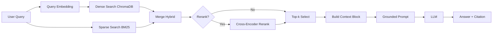

# Architecture - RAG Pipeline (Day 08 Lab)

## 1. Tổng quan kiến trúc

```text
[Raw Docs]
    ->
[index.py: Preprocess -> Chunk -> Embed -> Store]
    ->
[ChromaDB Vector Store]
    ->
[rag_answer.py: Query -> Retrieve -> (Rerank) -> Generate]
    ->
[Grounded Answer + Citation]
```

**Mô tả ngắn gọn:**
Hệ thống là trợ lý nội bộ cho khối CS + IT Helpdesk, trả lời câu hỏi về SLA, refund policy, access control và HR policy dựa trên tài liệu nội bộ. Pipeline dùng RAG để retrieve chứng cứ trước, sau đó mới generate câu trả lời có citation. Mục tiêu là giảm hallucination và có thể audit theo source.

---

## 2. Indexing Pipeline (Sprint 1)

### Tài liệu được index
| File | Nguồn | Department | Số chunk |
|------|-------|-----------|---------|
| `policy_refund_v4.txt` | `policy/refund-v4.pdf` | CS | 6 |
| `sla_p1_2026.txt` | `support/sla-p1-2026.pdf` | IT | 5 |
| `access_control_sop.txt` | `it/access-control-sop.md` | IT Security | 8 |
| `it_helpdesk_faq.txt` | `support/helpdesk-faq.md` | IT | 6 |
| `hr_leave_policy.txt` | `hr/leave-policy-2026.pdf` | HR | 5 |

**Tổng:** 30 chunks.

### Quyết định chunking
| Tham số | Giá trị | Lý do |
|---------|---------|-------|
| Chunk size | ~400 tokens (`CHUNK_SIZE=400`) | Đủ để giữ trọn nghĩa theo section/paragraph, không quá dài cho prompt |
| Overlap | ~80 tokens (`CHUNK_OVERLAP=80`) | Giảm mất context tại biên chunk |
| Chunking strategy | Heading-based -> paragraph-based fallback | Ưu tiên ranh giới tự nhiên (`=== ... ===`), sau đó split paragraph có overlap |
| Metadata fields | `source`, `section`, `department`, `effective_date`, `access` | Phục vụ filter, freshness, citation, audit |

### Embedding model
- **Model**: `text-embedding-3-small` (OpenAI)
- **Vector store**: ChromaDB `PersistentClient` tại `chroma_db_runtime/`
- **Similarity metric**: Cosine

---

## 3. Retrieval Pipeline (Sprint 2 + 3)

### Baseline (Sprint 2)
| Tham số | Giá trị |
|---------|---------|
| Strategy | Dense |
| Top-k search | 10 |
| Top-k select | 3 |
| Rerank | Không |

### Variant A (lần chạy 1)
| Tham số | Giá trị | Thay đổi so với baseline |
|---------|---------|------------------------|
| Strategy | Hybrid (dense + sparse BM25) | Dense -> Hybrid |
| Top-k search | 10 | Giữ nguyên |
| Top-k select | 3 | Giữ nguyên |
| Rerank | Không | Giữ nguyên |
| Query transform | Không bật | Giữ nguyên |
| Label trong config | `variant_hybrid` | - |

### Variant B (lần chạy 2)
| Tham số | Giá trị | Thay đổi so với Variant A |
|---------|---------|---------------------------|
| Strategy | Hybrid (dense + sparse BM25) | Giữ nguyên |
| Top-k search | 10 | Giữ nguyên |
| Top-k select | 3 | Giữ nguyên |
| Rerank | Có (`CrossEncoder: cross-encoder/ms-marco-MiniLM-L-6-v2`) | Không -> Có |
| Query transform | Không bật | Giữ nguyên |
| Label trong config | `variant_hybrid` | - |

**Lý do chọn Variant B:**
Variant A (hybrid không rerank) giảm relevance và completeness so với baseline. Khi bật rerank (Variant B), relevance và completeness tăng rõ trong khi context recall giữ nguyên 5.0. Điều này cho thấy rerank giúp lọc candidate trước khi build prompt.

**Kết quả được lưu thành các file riêng:**
- `results/scorecard_baseline_variant_a.md`
- `results/scorecard_variant_a.md`
- `results/ab_comparison_variant_a.csv`
- `results/scorecard_baseline_variant_b.md`
- `results/scorecard_variant_b.md`
- `results/ab_comparison_variant_b.csv`

---

## 4. Generation (Sprint 2)

### Grounded Prompt Template
```text
Answer only from the retrieved context below.
If the context is insufficient, say you do not know.
Cite the source field when possible.
Keep your answer short, clear, and factual.

Question: {query}

Context:
[1] {source} | {section} | score={score}
{chunk_text}

[2] ...

Answer:
```

### LLM Configuration
| Tham số | Giá trị |
|---------|---------|
| Model | `gpt-4o-mini` |
| Temperature | 0 |
| Max tokens | 512 |

---

## 5. Failure Mode Checklist

| Failure Mode | Triệu chứng | Cách kiểm tra |
|-------------|-------------|---------------|
| Index lỗi | Retrieve về docs cũ / sai version | `inspect_metadata_coverage()` trong `index.py` |
| Chunking tệ | Chunk cắt giữa điều khoản | `list_chunks()` và đọc text preview |
| Retrieval noise | Trả về chunk liên quan nhưng không đúng trọng tâm | So sánh Hybrid có/không rerank trong `eval.py` |
| Generation lỗi | Answer không grounded / bừa | `score_faithfulness()` trong `eval.py` |
| Token overload | Context quá dài -> lost in the middle | Kiểm tra độ dài `context_block` |

---

## 6. Diagram


