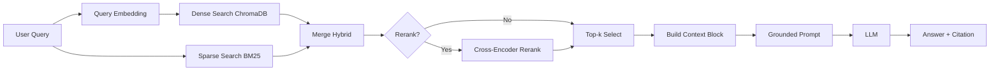

# Architecture - RAG Pipeline (Day 08 Lab)

## 1. Tổng quan kiến trúc

```text
[Raw Docs]
    ->
[index.py: Preprocess -> Chunk -> Embed -> Store]
    ->
[ChromaDB Vector Store]
    ->
[rag_answer.py: Query -> Retrieve -> (Rerank) -> Generate]
    ->
[Grounded Answer + Citation]
```

**Mô tả ngắn gọn:**
Hệ thống là trợ lý nội bộ cho khối CS + IT Helpdesk, trả lời câu hỏi về SLA, refund policy, access control và HR policy dựa trên tài liệu nội bộ. Pipeline dùng RAG để retrieve chứng cứ trước, sau đó mới generate câu trả lời có citation. Mục tiêu là giảm hallucination và có thể audit theo source.

---

## 2. Indexing Pipeline (Sprint 1)

### Tài liệu được index
| File | Nguồn | Department | Số chunk |
|------|-------|-----------|---------|
| `policy_refund_v4.txt` | `policy/refund-v4.pdf` | CS | 6 |
| `sla_p1_2026.txt` | `support/sla-p1-2026.pdf` | IT | 5 |
| `access_control_sop.txt` | `it/access-control-sop.md` | IT Security | 8 |
| `it_helpdesk_faq.txt` | `support/helpdesk-faq.md` | IT | 6 |
| `hr_leave_policy.txt` | `hr/leave-policy-2026.pdf` | HR | 5 |

**Tổng:** 30 chunks.

### Quyết định chunking
| Tham số | Giá trị | Lý do |
|---------|---------|-------|
| Chunk size | ~400 tokens (`CHUNK_SIZE=400`) | Đủ để giữ trọn nghĩa theo section/paragraph, không quá dài cho prompt |
| Overlap | ~80 tokens (`CHUNK_OVERLAP=80`) | Giảm mất context tại biên chunk |
| Chunking strategy | Heading-based -> paragraph-based fallback | Ưu tiên ranh giới tự nhiên (`=== ... ===`), sau đó split paragraph có overlap |
| Metadata fields | `source`, `section`, `department`, `effective_date`, `access` | Phục vụ filter, freshness, citation, audit |

### Embedding model
- **Model**: `text-embedding-3-small` (OpenAI)
- **Vector store**: ChromaDB `PersistentClient` tại `chroma_db_runtime/`
- **Similarity metric**: Cosine

---

## 3. Retrieval Pipeline (Sprint 2 + 3)

### Baseline (Sprint 2)
| Tham số | Giá trị |
|---------|---------|
| Strategy | Dense |
| Top-k search | 10 |
| Top-k select | 3 |
| Rerank | Không |

**Kết quả baseline:** Faithfulness 4.50 · Relevance 4.50 · Context Recall 5.00 · Completeness 3.90

### Variant A (lần chạy 1)
| Tham số | Giá trị | Thay đổi so với baseline |
|---------|---------|------------------------|
| Strategy | Hybrid (dense + sparse BM25) | Dense → Hybrid |
| Top-k search | 10 | Giữ nguyên |
| Top-k select | 3 | Giữ nguyên |
| Rerank | Không | Giữ nguyên |
| Query transform | Không bật | Giữ nguyên |

**Kết quả Variant A:** Faithfulness 4.70 · Relevance 4.10 · Context Recall 5.00 · Completeness 3.60  
**Δ so với baseline:** Relevance −0.40 · Completeness −0.30 → **Kém hơn baseline**

### Variant B — Cấu hình được chọn (lần chạy 2)
| Tham số | Giá trị | Thay đổi so với Variant A |
|---------|---------|---------------------------|
| Strategy | Hybrid (dense + sparse BM25) | Giữ nguyên |
| Top-k search | 10 | Giữ nguyên |
| Top-k select | 3 | Giữ nguyên |
| Rerank | Có (`CrossEncoder: cross-encoder/ms-marco-MiniLM-L-6-v2`) | Không → Có |
| Query transform | Không bật | Giữ nguyên |

**Kết quả Variant B:** Faithfulness 4.70 · Relevance 4.80 · Context Recall 5.00 · Completeness 4.00  
**Δ so với Variant A:** Relevance +0.70 · Completeness +0.40 → **Tốt nhất**

**Lý do chọn Variant B:**
Variant A (hybrid không rerank) giảm Relevance và Completeness so với baseline vì BM25 đưa vào noise candidates. Khi bật rerank (Variant B), CrossEncoder re-score lại toàn bộ candidates — Relevance tăng +0.70, Completeness tăng +0.40 so với Variant A, Context Recall vẫn giữ nguyên 5.00. Case điển hình: `q06` (SLA escalation P1) — Variant A retrieve nhầm chunk access control, Variant B sửa được nhờ rerank.

**Kết quả được lưu thành các file riêng:**
- `results/scorecard_baseline.md`
- `results/scorecard_variant.md` (= Variant B, best config)
- `results/scorecard_variant_a.md`, `results/scorecard_variant_b.md` (chi tiết)
- `results/ab_comparison_baseline_vs_a.csv` (dense vs hybrid)
- `results/ab_comparison_a_vs_b.csv` (hybrid vs hybrid+rerank)

---

## 4. Generation (Sprint 2)

### Grounded Prompt Template
```text
Answer only from the retrieved context below.
If the context is insufficient, say you do not know.
Cite the source field when possible.
Keep your answer short, clear, and factual.

Question: {query}

Context:
[1] {source} | {section} | score={score}
{chunk_text}

[2] ...

Answer:
```

### LLM Configuration
| Tham số | Giá trị |
|---------|---------|
| Model | `gpt-4o-mini` |
| Temperature | 0 |
| Max tokens | 512 |

---

## 5. Failure Mode Checklist

| Failure Mode | Triệu chứng | Cách kiểm tra |
|-------------|-------------|---------------|
| Index lỗi | Retrieve về docs cũ / sai version | `inspect_metadata_coverage()` trong `index.py` |
| Chunking tệ | Chunk cắt giữa điều khoản, mất section header | `list_chunks()` và đọc text preview |
| Retrieval nhầm section | Lấy đúng document nhưng sai section trong cùng file | So sánh chunk text vs expected section trong `eval.py` |
| Retrieval noise (cross-doc) | BM25 match keyword từ doc không liên quan | So sánh Hybrid có/không rerank trong `eval.py` |
| Generation hallucinate | LLM thêm exception/điều kiện không có trong context | `score_faithfulness()` — xem câu nào F < 3 |
| Abstain mơ hồ | Model nói "không biết" nhưng không giải thích lý do thiếu context | Kiểm tra câu Insufficient Context trong scorecard |
| Completeness thấp | Answer đúng nhưng thiếu detail (con số, tên cụ thể) | `score_completeness()` — xem missing_points trong notes |
| Token overload | Context quá dài → lost in the middle | Kiểm tra độ dài `context_block` |

### Failure modes quan sát từ grading run (gq01–gq10, Variant B)

| Câu | Failure Mode | Root Cause | Mức độ |
|-----|-------------|-----------|--------|
| gq02 | Completeness thấp | Thiếu tên phần mềm "Cisco AnyConnect" — nằm trong FAQ detail, không vào top chunk | Partial |
| gq04 | Completeness thấp | Thiếu từ "tùy chọn" — một từ trong một câu duy nhất, dễ bị bỏ qua | Partial |
| gq05 | Retrieval nhầm section | Lấy nhầm Section 4 (emergency temp access) thay vì Section 2 (Level 4 Admin procedure) trong cùng `access_control_sop.md` | Partial/Zero |
| gq07 | Abstain mơ hồ | Model nói "Tôi không biết" nhưng không nêu rõ thông tin không có trong tài liệu | Partial (5/10) |
| gq09 | Completeness thấp | Thiếu kênh đổi mật khẩu (SSO portal / ext. 9000) — nằm trong cùng chunk nhưng không được đưa vào answer | Partial |

---

## 6. Diagram


