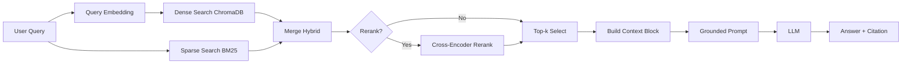

# Architecture - RAG Pipeline (Day 08 Lab)

## 1. Tong quan kien truc

```text
[Raw Docs]
    ->
[index.py: Preprocess -> Chunk -> Embed -> Store]
    ->
[ChromaDB Vector Store]
    ->
[rag_answer.py: Query -> Retrieve -> (Rerank) -> Generate]
    ->
[Grounded Answer + Citation]
```

**Mo ta ngan gon:**
He thong la tro ly noi bo cho khoi CS + IT Helpdesk, tra loi cau hoi ve SLA, refund policy, access control va HR policy dua tren tai lieu noi bo. Pipeline dung RAG de retrieve chung cu truoc, sau do moi generate cau tra loi co citation. Muc tieu la giam hallucination va co the audit theo source.

---

## 2. Indexing Pipeline (Sprint 1)

### Tai lieu duoc index
| File | Nguon | Department | So chunk |
|------|-------|-----------|---------|
| `policy_refund_v4.txt` | `policy/refund-v4.pdf` | CS | 6 |
| `sla_p1_2026.txt` | `support/sla-p1-2026.pdf` | IT | 5 |
| `access_control_sop.txt` | `it/access-control-sop.md` | IT Security | 8 |
| `it_helpdesk_faq.txt` | `support/helpdesk-faq.md` | IT | 6 |
| `hr_leave_policy.txt` | `hr/leave-policy-2026.pdf` | HR | 5 |

**Tong:** 30 chunks.

### Quyet dinh chunking
| Tham so | Gia tri | Ly do |
|---------|---------|-------|
| Chunk size | ~400 tokens (`CHUNK_SIZE=400`) | Du de giu tron nghia theo section/paragraph, khong qua dai cho prompt |
| Overlap | ~80 tokens (`CHUNK_OVERLAP=80`) | Giam mat context tai bien chunk |
| Chunking strategy | Heading-based -> paragraph-based fallback | Uu tien ranh gioi tu nhien (`=== ... ===`), sau do split paragraph co overlap |
| Metadata fields | `source`, `section`, `department`, `effective_date`, `access` | Phuc vu filter, freshness, citation, audit |

### Embedding model
- **Model**: `text-embedding-3-small` (OpenAI)
- **Vector store**: ChromaDB `PersistentClient` tai `chroma_db_runtime/`
- **Similarity metric**: Cosine

---

## 3. Retrieval Pipeline (Sprint 2 + 3)

### Baseline (Sprint 2)
| Tham so | Gia tri |
|---------|---------|
| Strategy | Dense |
| Top-k search | 10 |
| Top-k select | 3 |
| Rerank | Khong |

### Variant duoc chon de trien khai tiep (Variant B)
| Tham so | Gia tri | Thay doi so voi baseline |
|---------|---------|------------------------|
| Strategy | Hybrid (dense + sparse BM25) | Dense -> Hybrid |
| Top-k search | 10 | Giu nguyen |
| Top-k select | 3 | Giu nguyen |
| Rerank | Co (`CrossEncoder: cross-encoder/ms-marco-MiniLM-L-6-v2`) | Khong -> Co |
| Query transform | Khong bat | Giu nguyen |

**Ly do chon Variant B:**
Variant A (hybrid khong rerank) khong on dinh o relevance/completeness. Khi bat rerank (Variant B), trung binh relevance va completeness tang ro, trong khi context recall giu nguyen 5.0. Dieu nay cho thay noise retrieval da duoc loc tot hon truoc khi vao prompt.

---

## 4. Generation (Sprint 2)

### Grounded Prompt Template
```text
Answer only from the retrieved context below.
If the context is insufficient, say you do not know.
Cite the source field when possible.
Keep your answer short, clear, and factual.

Question: {query}

Context:
[1] {source} | {section} | score={score}
{chunk_text}

[2] ...

Answer:
```

### LLM Configuration
| Tham so | Gia tri |
|---------|---------|
| Model | `gpt-4o-mini` |
| Temperature | 0 |
| Max tokens | 512 |

---

## 5. Failure Mode Checklist

| Failure Mode | Trieu chung | Cach kiem tra |
|-------------|-------------|---------------|
| Index loi | Retrieve ve docs cu / sai version | `inspect_metadata_coverage()` trong `index.py` |
| Chunking te | Chunk cat giua dieu khoan | `list_chunks()` va doc text preview |
| Retrieval noise | Tra ve chunk lien quan nhung khong dung trong tam | So sanh Hybrid co/khong rerank trong `eval.py` |
| Generation loi | Answer khong grounded / bua | `score_faithfulness()` trong `eval.py` |
| Token overload | Context qua dai -> lost in the middle | Kiem tra do dai `context_block` |

---

## 6. Diagram


